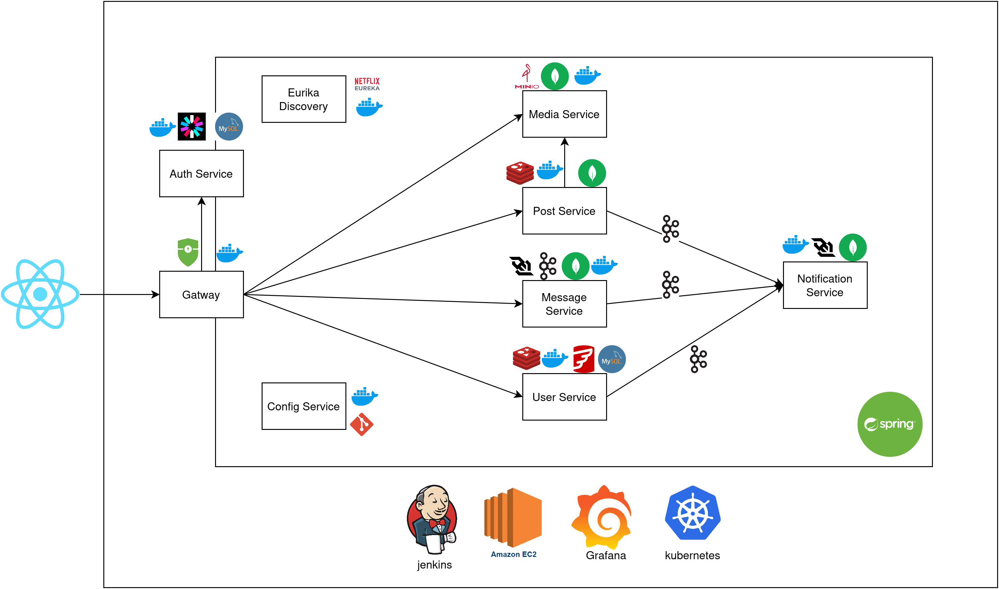

# Social Media Platform (Microservices with Spring Boot)

[](https://spring.io/)
[](https://www.docker.com/)
[](LICENSE)

**Educational project** demonstrating a social media platform built with Spring Boot microservices. Currently in active development.

## 📌 Overview

A learning-focused implementation featuring:
- JWT-based authentication 
- Caching with Redis
- Microservices cloud  architecture 
- Event-driven architecture with Kafka
- Containerized services and orchestration  using Docker and kubernetes
- CI/CD pipelines with Jenkins



## 🛠️ Core Services

**Implemented:**
- **User Service**: Account management & profiles
- ****: Users Registration and JWT token generation
-  ****:Message and Video/Voice calls
- **Post Service**: Content creation & management
- **Config Service**: Centralized configuration
- **Discovery Service**: Service registration
- **Gateway**: API routing & load balancing
- **Media Service**: File storage (MinIO)

**In Development:**
- **Message Service** (direct messaging)
- **Notification Service** (real-time alerts and notification )

## 🔧 Tech Stack

**Infrastructure:**
- Docker Compose (local development)
- Kubernetes (production deployment - WIP)
- AWS EC2 (future hosting)

**Data Stores:**
- MySQL (relational data)
- MongoDB (NoSQL data)
- Redis (caching)
- MinIO (object storage)

**Communication:**
- HTTP/REST for external APIs
- Kafka for event streaming

## 🚀 Getting Started

### Prerequisites
- Docker 20.10+ & Docker Compose
- (Optional) Minikube for Kubernetes testing

### Quick Start (Docker Compose)
```bash
# Start all services and dependencies
docker-compose up --build
```

### Kubernetes Deployment (Local)
```bash
cd k8s/
kubectl apply -f .
```

## 📚 API Documentation
Access OpenAPI specs at:
- `http://localhost:8080/{service-name}/swagger-ui.html` (after startup)

## 🔄 CI/CD Pipeline
- Jenkins automation for:
    - Container builds
    - Integration testing
    - Kubernetes deployment (WIP)

  

## 🤝 Contributing
This educational project welcomes:
- Bug reports
- Architecture suggestions
- Documentation improvements

1. Fork the repository
2. Create your feature branch (`git checkout -b feature/your-feature`)
3. Commit changes following existing code standards
4. Open a Pull Request with detailed description

## 📄 License
Distributed under MIT License - see [LICENSE](LICENSE) for details.

## 🚧 Development Status
- [X] User Service Core implementation 
- [X] authentication service with Jwt 
- [X] Discovery and config services
- [X] Gateway with Jwt validation 
- [X] media service with file streaming 
- [X] Post Service Core Implementation
- [ ] Message Service with websockets and kafka streaming
- [ ] Notification Service with websockets and kafka streaming
- [ ] Cache implementation for user and post services
- [ ] Kubernetes full configuration
- [ ] Grafana dashboard integration
- [ ] Implementing circuit breaker with Resilience4j
- [ ] A UI with react
- [ ] AWS EC2 deployment guide


