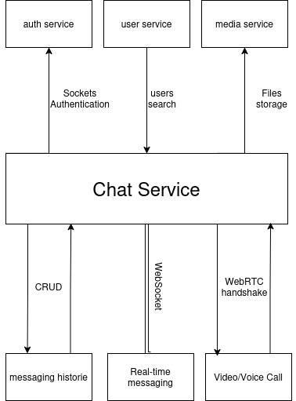

c# Chat Service

The **Chat Service** is a Spring Boot microservice responsible for handling chat messaging and Voice/Video Calls in the **Social Media Platform**. 

---

## 📌 Features

* **Real-time messaging** – Authenticate users with username and password, and return a JWT token.
* **video/voice calls** – Sign up new users with required details.


---

## 🚀 Tech Stack

* **Spring Web**
* **WebSockets**
* **Web RTC**
* **Lombok**

---

## 📌 Overview



---

## 📂 Project Structure

```
chat-service/
├── ChatServiceApplication.java
├── config
│   ├── ConnectionListener.java
│   └── WebSocketConfig.java
├── controller
│   ├── ChatController.java
│   └── HttpController.java
├── dto
│   ├── ChatResponseDto.java
│   ├── MessageRequestDto.java
│   ├── MessageResponseDto.java
│   ├── SignalMessage.java
│   └── UpdateMessageDto.java
├── entity
│   ├── Chat.java
│   ├── ChatType.java
│   ├── Message.java
│   └── MessageType.java
├── Mapper
│   └── Mapper.java
├── repository
│   ├── ChatRepository.java
│   └── MessageRepository.java
└── service
    └── ChatService.java

 
```

---

## 🔑 Endpoints

### 1. **Get Chat**

Get user Chat historie

**GET** `/api/v1/chat/{username}`


#### Response:

```json
{
  "username": "john_doe",
  "messages": [
    {
      "id": "324516",
      "sender": "john_doe",
      "receiver": "jane_smith",
      "body": "Hey Jane, how are you?",
      "timestamp": "2025-10-26T10:30:00Z",
      "seen": true
    },
    {
      "id": "2133",
      "sender": "jane_smith",
      "receiver": "john_doe",
      "body": "I'm doing great! How about you?",
      "timestamp": "2025-10-26T10:31:00Z",
      "seen": false
    }
  ]
}
```

---

### 2. **Edit Message**

Edit an existing message.

**POST** `/api/v1/chat/message`

#### Request Body:

```json
{
  "id": "12345",
  "body": "Hey, just wanted to update this message!",
  "seen": true
}

```

#### Response:

200 Ok

---

### 3. **Connect to Chat socket**

connect to the chat web Socket.

**WS** `/api/v1/Chat`

---

### 4. **Sending message**

Send Throught Stomp client.

**WS** `/message/{username}`
#### Body:
```json
{
  "body": "Hey, check out this new photo!",
  "owner": "john_doe",
  "type": "IMAGE",
  "file": null
}
```

---

### 5. **Sending Call's handshake**


**WS** `/call/{username}`

#### Body:
```json
{
  "target": "user_b",
  "from": "user_a",
  "signal": {
    "type": "offer",
    "sdp": "v=0\r\no=- 46117326 2 IN IP4 127.0.0.1\r\ns=-\r\nt=0 0\r\na=group:BUNDLE 0\r\na=msid-semantic: WMS\r\n..."
  }
}
```

---


## ⚠️ Error Handling

### Comming Soon ..
---

## ⚙️ Configuration


## ▶️ Running the Service

### 1. Build with Maven:

```bash
mvn clean install
```

### 2. Run the application:

```bash
mvn spring-boot:run
```

The service will be available at:
👉 `http://localhost:8080/api/v1/chat`
👉 `ws://localhost:8080/api/v1/chat`


---

## ✅ Next Steps

* Add **a better ui** .
* **optimize and enhance error handling**.


